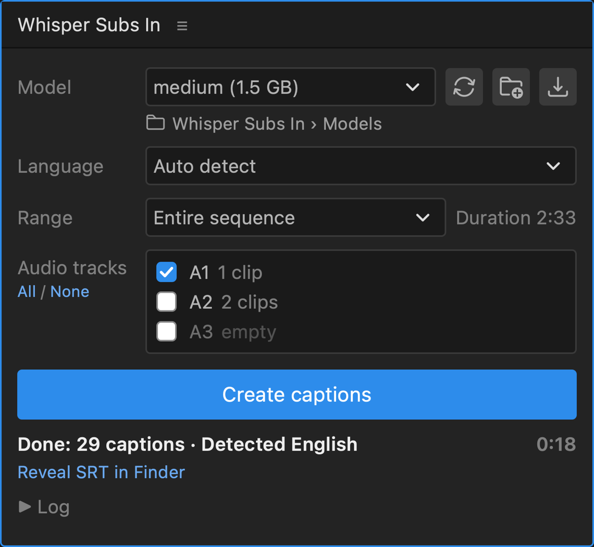

# Whisper Subs In

**English** · [繁體中文](README.zh-TW.md)

This is a Premiere Pro panel that creates caption tracks with Whisper, right inside Premiere. Click once and a caption track appears on your sequence. Everything runs on your own computer; nothing is uploaded.



**[⬇ Download the latest version](https://github.com/LouieLu1129/whisper-subs-in/releases/latest)**

> [!IMPORTANT]
> **The first time you open the installer, macOS will block it. Click Done — do not click Move to Trash.**
> Then allow it in **System Settings → Privacy & Security → Open Anyway**. See [Install](#install) for the steps and [Is it safe?](#is-it-safe) for why this happens.

## Why

To get Whisper captions into Premiere, I used to take a long detour: export the audio, open a transcription app, wait for it to finish, import the SRT, then drag it back onto the timeline. This panel brings those steps into Premiere, while still letting you choose the model, language, range and audio tracks.

It aims to give you a reasonably accurate caption track to refine by hand, so it keeps Whisper's own wording, line breaks and timing. If you often need to skim long footage and cut it down into a shorter edit, I hope it helps.

## Features

- One click from sequence to caption track
- Transcribe the entire sequence or just In to Out
- Choose which audio tracks to use
- Language auto-detect, or pick one
- **Traditional or Simplified Chinese, your choice:** Pick Traditional or Simplified and every caption uses the characters you want, whatever the model or the speaker's accent. Only the characters change, not the wording, so regional terms stay as spoken and are easy to spot when you proofread.
- Runs offline on Apple silicon, with the transcription engine built in

## Requirements

- A Mac with Apple silicon (M1 or later), macOS 13 or later
- Premiere Pro 2022 or later (tested with Premiere Pro 2026)

## Install

1. **Download** the latest `WhisperSubsIn-v….zip` from [Releases](https://github.com/LouieLu1129/whisper-subs-in/releases/latest) and unzip it.
2. **Double-click `Install Whisper Subs In.command`.**
   The first time, macOS blocks it because it isn't signed by Apple. To allow it:
   1. Click **Done** in the message. **Don't click Move to Trash.**
   2. Open **System Settings → Privacy & Security**, scroll down, and click **Open Anyway** next to the installer's name.
   3. Confirm with your password or Touch ID. The installer runs in a Terminal window and tells you when it's done.
3. **Add a model.** I suggest starting with a smaller model such as [ggml-medium.bin](https://huggingface.co/ggerganov/whisper.cpp/resolve/main/ggml-medium.bin) (1.5 GB) for a first test. Put it in `Documents › Whisper Subs In › Models`.
4. **Quit Premiere Pro completely (⌘Q) and reopen it.** Then choose **Window → Extensions → Whisper Subs In**.

## Is it safe?

macOS blocks the installer because it isn't signed by Apple, which requires a paid Apple Developer membership. That is common for free open-source tools; it doesn't mean the file is harmful.

The installer is a plain text script. You can open `Install Whisper Subs In.command` in TextEdit and read it before running it. It does three things:

1. Copies the panel into `~/Library/Application Support/Adobe/CEP/extensions/`.
2. Removes the "downloaded from the internet" flag from the panel's files, so the built-in transcription engine is allowed to run.
3. Turns on Premiere's `PlayerDebugMode`, which lets Premiere load panels that aren't signed by Adobe.

**Only download Whisper Subs In from this repository's [Releases](https://github.com/LouieLu1129/whisper-subs-in/releases) page.** Each release lists the SHA-256 checksum of its zip. To check your download, run `shasum -a 256` followed by the zip file in Terminal and compare the result.

`PlayerDebugMode` applies to all such panels, not only this one, so only install panels you trust. To turn it off later, run `defaults write com.adobe.CSXS.12 PlayerDebugMode 0` in Terminal (Whisper Subs In will then stop loading).

## Models

Whisper Subs In uses Whisper models in the `.bin` format made for [whisper.cpp](https://github.com/ggml-org/whisper.cpp). It doesn't download them for you.

I use **ggml-medium** (1.5 GB) as my default. It handles everyday videos well in many languages. Other sizes are on the [whisper.cpp model page](https://huggingface.co/ggerganov/whisper.cpp/tree/main): smaller ones are faster, larger ones can be more accurate but take longer.

Already have `.bin` models from another Whisper app? Click the **Add folder** button next to the Model menu to use that folder, so you don't need to download them again.

## Usage

1. Open the sequence you want to caption.
2. Choose the model, language, range and audio tracks.
3. Click **Create captions**.

The captions are saved as an SRT file next to your project and added to the sequence as a caption track. Premiere may pause while the audio is exported; that's normal.

**Tip:** if a sequence opens with a long stretch of music or B-roll, set In and Out around the spoken part for more accurate timing.

## Uninstall

Double-click `Uninstall Whisper Subs In.command`. Your models stay in `Documents › Whisper Subs In`; delete that folder too if you no longer need them.

## Build from source

For developers. You need the Xcode Command Line Tools and [CMake](https://cmake.org).

```bash
bash scripts/build-engine.sh   # builds the whisper.cpp engine into panel/bin/
bash scripts/package.sh        # makes the release zip in dist/
```

## Credits

- [whisper.cpp](https://github.com/ggml-org/whisper.cpp) by Georgi Gerganov and contributors, the transcription engine (MIT)
- [Whisper](https://github.com/openai/whisper) by OpenAI, the speech recognition models (MIT)
- [opencc-js](https://github.com/nk2028/opencc-js) by the nk2028 project, with dictionaries from [OpenCC](https://github.com/BYVoid/OpenCC), for Traditional and Simplified conversion (MIT, Apache-2.0)
- [Spectrum Workflow Icons](https://github.com/adobe/spectrum-css-workflow-icons) by Adobe (Apache-2.0)
- Inspired by [AutoSubs](https://github.com/tmoroney/auto-subs) by Tom Moroney, which showed how to export sequence audio and create caption tracks in Premiere

Full license texts are in [THIRD_PARTY_NOTICES.md](THIRD_PARTY_NOTICES.md).

## License

[MIT](LICENSE) © 2026 LouieLu1129

Whisper Subs In is an independent project and is not affiliated with Adobe or OpenAI. Premiere Pro is a trademark of Adobe.
